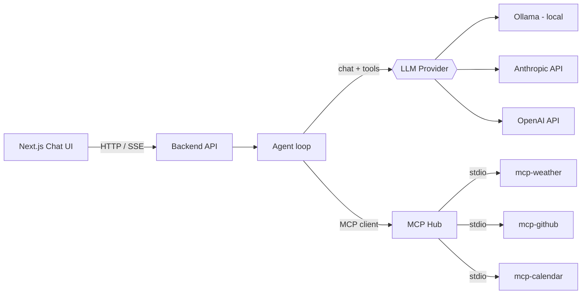

# AI Assistant MCP

A local-first AI assistant built on the **Model Context Protocol (MCP)**. A chat agent talks to an LLM and calls tools exposed by independent MCP servers (weather, GitHub, calendar). The LLM backend is swappable: run **Ollama** locally for free, or switch to **Claude** / **OpenAI** by changing one environment variable.

> Built with TypeScript, Node.js, Ollama and the official MCP SDK.

## Why this project

- Shows how to build **MCP servers** (tools) and an **MCP client** (the agent that uses them).
- Shows a clean **provider abstraction**: the agent never knows which LLM it is talking to.
- Runs fully offline with a local model, with no API key required.

## Architecture



**How one request flows**

1. The user sends a message in the chat UI.
2. The backend passes the conversation and the list of available tools to the LLM.
3. If the LLM asks to call a tool (e.g. `get_weather`), the agent runs it through the matching MCP server.
4. The tool result is sent back to the LLM, which writes the final answer.
5. Steps 2 to 4 repeat until the LLM answers without a tool call (max 5 steps to avoid infinite loops).

## Project structure

```
ai-assistant-mcp/
├── frontend/            # Next.js chat UI
├── backend/
│   └── src/
│       ├── index.ts         # API server
│       ├── agent.ts         # Agent loop: LLM <-> tools
│       ├── mcp-client.ts    # Connects to the MCP servers
│       └── llm/
│           ├── types.ts     # LLMProvider interface
│           ├── ollama.ts    # Ollama provider
│           ├── anthropic.ts # Claude provider
│           ├── openai.ts    # OpenAI provider
│           └── index.ts     # Picks provider from LLM_PROVIDER
├── mcp-weather/         # MCP server: current weather (Open-Meteo, no key)
├── mcp-github/          # MCP server: GitHub repos / issues
├── mcp-calendar/        # MCP server: Google Calendar
├── docker-compose.yml
├── .env.example
└── README.md
```

## MCP servers

| Server         | Tools                         | Needs                              |
| -------------- | ----------------------------- | ---------------------------------- |
| `mcp-weather`  | `get_weather(city)`           | Nothing (uses free Open-Meteo API) |
| `mcp-github`   | List repos, read issues, etc. | GitHub personal access token       |
| `mcp-calendar` | List / create events          | Google OAuth credentials           |

Each server is a small standalone Node process that speaks MCP over **stdio**. The backend starts them as child processes, so they need no ports or containers of their own.

## Status

- [x] `mcp-weather` server
- [x] LLM provider interface + Ollama provider
- [ ] MCP client (`mcp-client.ts`)
- [ ] Agent loop (`agent.ts`)
- [ ] Backend API
- [ ] Anthropic and OpenAI providers
- [ ] Chat UI
- [ ] `mcp-github`
- [ ] `mcp-calendar`
- [ ] Docker Compose
- [ ] CI (lint, build, tests)

## Requirements

- Node.js 22 LTS or newer
- [Ollama](https://ollama.com) with a model that supports tool calling, for example:
  ```bash
  ollama pull qwen2.5:7b
  ```
- Docker (optional)

## Quick start

### 1. Test the weather MCP server

```bash
cd mcp-weather
npm install
npm run inspect
```

This opens the MCP Inspector in your browser. Click **Connect**, open **Tools**, choose `get_weather`, enter a city and run it.

### 2. Test the LLM connection

Make sure Ollama is running, then:

```bash
cd backend
npm install
npx tsx src/test-ollama.ts
```

You should see a `toolCalls` entry for `get_weather`. This confirms the model can request tools.

### 3. Run everything

Not available yet. This section will be filled in once the backend and UI are finished.

## Switching LLM provider

Set `LLM_PROVIDER` in your `.env` file. No code changes needed.

| Provider         | Variables                                                                             |
| ---------------- | ------------------------------------------------------------------------------------- |
| Ollama (default) | `LLM_PROVIDER=ollama`, `OLLAMA_URL=http://localhost:11434`, `OLLAMA_MODEL=qwen2.5:7b` |
| Claude           | `LLM_PROVIDER=anthropic`, `ANTHROPIC_API_KEY=...`                                     |
| OpenAI           | `LLM_PROVIDER=openai`, `OPENAI_API_KEY=...`                                           |

Copy `.env.example` to `.env` and fill in only what you use. Never commit `.env` or the `credentials/` folder.

## Docker (planned)

| Setup                                    | Command                                                          |
| ---------------------------------------- | ---------------------------------------------------------------- |
| Ollama already installed on your machine | `docker compose up`                                              |
| Ollama inside Docker                     | `docker compose --profile with-ollama up`                        |
| Use Claude instead                       | `LLM_PROVIDER=anthropic ANTHROPIC_API_KEY=... docker compose up` |

When the backend runs in a container, it reaches host Ollama through `http://host.docker.internal:11434`. On Linux, Ollama must listen on `0.0.0.0`.

## Design decisions

- **stdio transport for MCP servers.** Simplest to run and debug, with no network setup and no extra containers.
- **`LLMProvider` interface.** Each provider translates one shared message and tool format into its own SDK format, so the agent code stays identical across Ollama, Claude and OpenAI.
- **Step limit in the agent loop.** Small local models sometimes call tools incorrectly or repeat themselves, so the loop stops after a fixed number of steps.
- **Tool errors are returned to the model.** A failed tool call becomes text the LLM can read and recover from, instead of crashing the request.

## Notes on MCP stdio servers

Never use `console.log` inside an MCP server. stdout carries the protocol messages, so extra output breaks the connection. Use `console.error` for debugging.

## Roadmap

- Streaming responses to the UI (SSE)
- Tests for the agent loop with a mock LLM provider
- More MCP servers (filesystem, web search)
- Tool call visualisation in the chat UI

## License

MIT